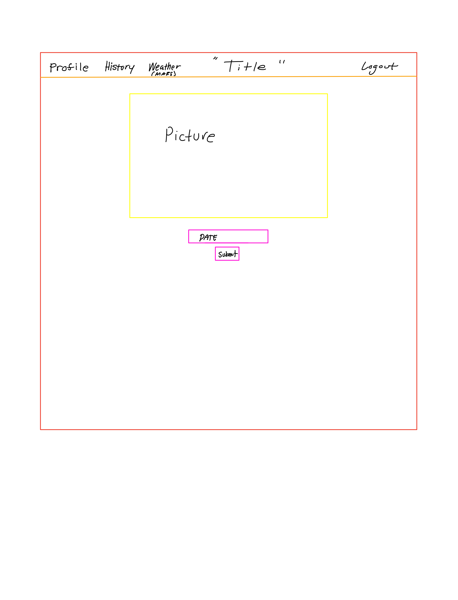
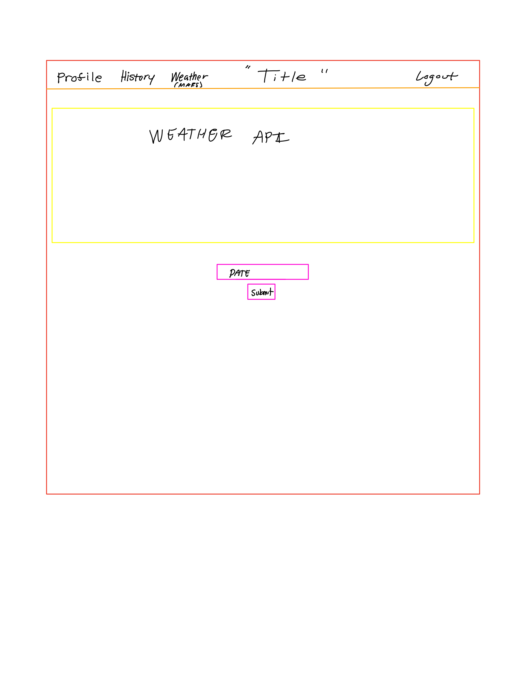
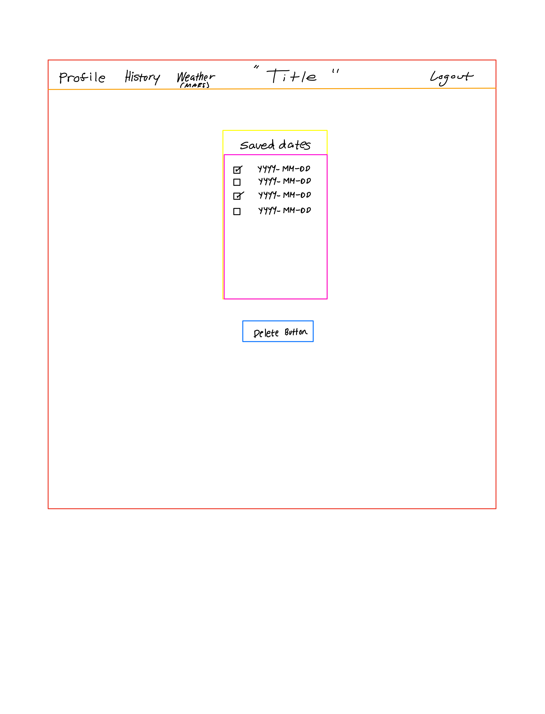
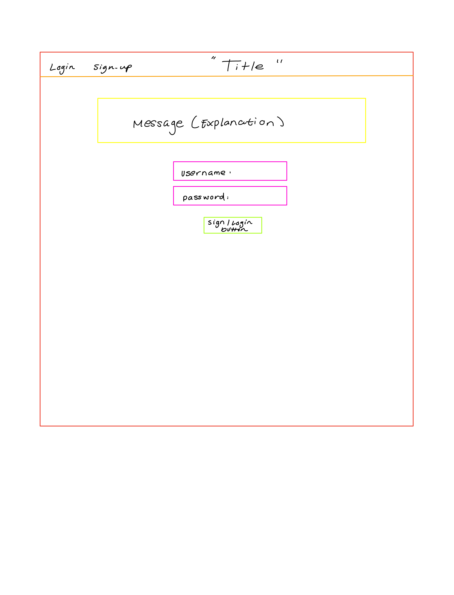

# Project 2: Explore the Universe

## Description of App 
This app will ask you to sign up or login to your profile. After logging in you will be to see a home page were ther will be two links. One link will allow you to go to NASA's picture of the day where you will be able to put in a date and it will show you the picture of the day. The next link will be to a route allow you to see the weather of Mars. Then the user would be able to log out or go back to the home page.

## Install Instructions
* install the npm add ons `npm install`
* Now you would need to create a database and migrate it using: `sequelize create:db --name sf-auth -- attributes ` and `sequelize db:migrate`
## Link to Deploy

## User Stories
* As a user I want to be able to search a date and be able to see the picture of the day on that specific date
* As a user I want to be able to add these dates to a history tab where I could see the dates I have already used and be able to select date and delete them from the history.
## Explanation of Tech
We are going to be using npm packages such as express, ejs, ejs layouts, cookie-parser, env, crypto-js, and bcrypt in order to make a full stack website. We will be able to make routes using JS with the installed packages in order to allow the user to navigate through the website. I will also be using NASA's API's (APOD and Insight) 
## Wireframes

## ERDs

## Restful Routes
| Method | Path | Purpose |
|:-------|:-----:|--------:|
|**GET**|`/`| Home page that list all routes as links.|
|**POST**|`/`|This route checks if the user has already made an account if not hashes a password and ecrypts user, then redirects back to homepage.| 
|**GET**|`/profile`| Route to profile page of user that is logged in.|
|**GET**|`/new`| This route will take the user to the sign up page.|
|**GET**|`/login`|This route will take the user to the login page.|
|**POST**|`/login`|This isplays error massage if user is not found in database or password is wrong. If both are correct then it logs in user.
|**GET**|`/logout`|This route will allow the user to logout of there profile.|
|**DELETE**|`/comment/:id`|This route will allow the user to delete a comment.||
|**PUT**|`/comment/:id`|This route will allow the user to edit a comment.|
|**GET**|`/weather`|This route will take the user to the weather on mars page.|
|**POST**|`/weather`|This route will allow the user to enter a date and it will store it.

## Post-Project
* be able to incorperate more apis and pages that the user can use.
* be able to leave messages about a specific picture.
## Sources
api.nasa.gov

makeuseof.com
